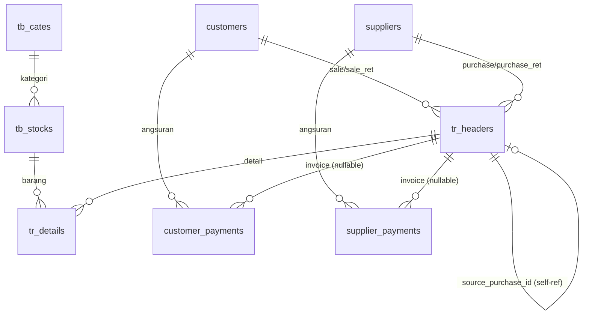

# Architecture Document — RPS Lite

---

## 1. Arsitektur Keseluruhan (High-Level)

```
┌─────────────────────────────────────────────────────────────────┐
│                        USER (Browser)                           │
└────────────────────────────────┬────────────────────────────────┘
                                 │ HTTPS
                                 ▼
┌─────────────────────────────────────────────────────────────────┐
│                      LARAVEL 13 APPLICATION                     │
│  ┌──────────────┐  ┌──────────────┐  ┌──────────────────────┐  │
│  │  Filament 5  │  │  Controllers │  │   Custom Routes      │  │
│  │  Admin Panel │  │  (minimal)   │  │  (struk, export,     │  │
│  │  (Resources, │  │              │  │   laporan cetak)     │  │
│  │   Pages,     │  │              │  │                      │  │
│  │   Widgets)   │  │              │  │                      │  │
│  └──────┬───────┘  └──────┬───────┘  └──────────┬────────────┘  │
│         │                 │                      │              │
│         └─────────────────┼──────────────────────┘              │
│                           ▼                                     │
│  ┌──────────────────────────────────────────────────────────┐  │
│  │                    SERVICE LAYER (Models)                  │  │
│  │  TbCate, TbStock, Customer, Supplier, TrHeader, TrDetail, │  │
│  │  CustomerPayment, SupplierPayment, User                   │  │
│  └────────────────────────────┬──────────────────────────────┘  │
│                               │                                 │
│                               ▼                                 │
│  ┌──────────────────────────────────────────────────────────┐  │
│  │                    DATABASE (SQLite)                       │  │
│  │  tb_cates, tb_stocks, customers, suppliers, tr_headers,  │  │
│  │  tr_details, customer_payments, supplier_payments,       │  │
│  │  users, cache, jobs, sessions                            │  │
│  └──────────────────────────────────────────────────────────┘  │
└─────────────────────────────────────────────────────────────────┘
```

**Pola**: MVC standar Laravel + **Filament Resources/Pages** sebagai UI layer utama. Tidak ada API layer terpisah (kecuali route custom untuk cetak/export).

---

## 2. Stack Teknologi

| Layer | Teknologi | Versi | Catatan |
|-------|-----------|-------|---------|
| **Runtime** | PHP | ^8.3 (8.5 direkomendasikan) | |
| **Framework** | Laravel | ^13.8 | |
| **Admin UI** | Filament | ^5.0 | Panel tunggal (`admin`) |
| **Database** | SQLite | Default | File `database/database.sqlite` |
| **Testing** | Pest | ^5.1 | Feature tests, `--compact` |
| **Code Style** | Laravel Pint | ^1.27 | PSR-12 + Laravel conventions |
| **Frontend Build** | Vite | 8.x | + Tailwind CSS 4 |
| **Package Manager** | Composer / npm | Latest | |

---

## 3. Struktur Direktori Kunci

```
app/
├── Filament/
│   ├── Actions/              # SafeDeleteAction (hapus aman FK)
│   ├── Pages/                # Laporan (Page + HasTable)
│   │   ├── LaporanPenjualan.php
│   │   ├── LaporanKartuStok.php
│   │   ├── LaporanPiutang.php
│   │   ├── LaporanKartuPiutang.php
│   │   ├── LaporanNilaiPersediaan.php
│   │   └── Tables/           # Query & buildRows per laporan
│   ├── Resources/            # Semua Resource (Master + Transaksi)
│   │   ├── TbCates/          # Kategori
│   │   ├── TbStocks/         # Barang/Stok
│   │   ├── TbCustomers/      # Customer
│   │   ├── TbSuppliers/      # Supplier
│   │   ├── TrPurchases/      # Pembelian (model TrHeader)
│   │   ├── TrPurchaseReturns/ # Retur Pembelian
│   │   ├── TrSales/          # Penjualan
│   │   ├── TrSaleReturns/    # Retur Penjualan
│   │   ├── TrOpnames/        # Stok Opname
│   │   ├── CustomerPayments/ # Angsuran Customer
│   │   └── SupplierPayments/ # Angsuran Supplier (placeholder)
│   ├── Widgets/              # Dashboard widgets
│   └── ...
├── Models/                   # Eloquent Models
│   ├── TbCate.php
│   ├── TbStock.php
│   ├── Customer.php
│   ├── Supplier.php
│   ├── TrHeader.php
│   ├── TrDetail.php
│   ├── CustomerPayment.php
│   ├── SupplierPayment.php
│   └── User.php
├── Http/Controllers/         # Minimal (hanya custom routes)
├── Providers/
│   └── Filament/
│       └── AdminPanelProvider.php  # Panel config, custom routes
database/
├── migrations/               # 13 migration files
├── factories/                # Model factories untuk testing
└── seeders/                  # Database seeders
resources/
├── views/
│   ├── struk/penjualan.blade.php      # Struk thermal 80mm
│   └── laporan/kartu-stok.blade.php   # Cetak kartu stok
└── css/app.css             # Tailwind entry
tests/
├── Feature/                # Pest feature tests
├── Unit/                   # Pest unit tests
└── Pest.php                # Config Pest
```

---

## 4. Pola Desain & Konvensi

### 4.1 Resource Filament (CRUD Transaksi & Master)

**Struktur folder per resource**:
```
Resources/<Nama>/
├── <Nama>Resource.php       # Model, navigation, slug, getEloquentQuery()
├── Schemas/<Nama>Form.php   # Form components (modal)
├── Tables/<Nama>Table.php   # Table columns, filters, actions
└── Pages/List<Nama>.php     # List page + CreateAction modal
```

**Konvensi**:
- Semua transaksi pakai **modal form** di halaman List (tidak ada Create/Edit page terpisah)
- `CreateAction::make()->using(...)->databaseTransaction()` untuk atomic save
- Resource transaksi filter `TrHeader` via `getEloquentQuery()->where('trr_type', ...)`
- Repeater detail **bukan** relationship → disimpan manual di `using()` closure

### 4.2 Laporan (Filament Pages)

```
Pages/LaporanXxx.php  (implements HasTable, InteractsWithTable)
├── Header Action "Generate" (modal filter) → simpan ke property Livewire
├── EmbeddedTable::make() di content()
└── Tables/LaporanXxxTable.php (query + buildRows())
```

**Cetak/Export**: Route GET di `AdminPanelProvider::authenticatedRoutes()` → return View (auto-print) atau Stream CSV (UTF-8 BOM).

### 4.3 Model Eloquent

- `$fillable` wajib lengkap untuk semua kolom form/tabel
- `$casts`: `decimal:2` untuk uang, `date` untuk tanggal
- Relasi eksplisit: `belongsTo`, `hasMany`
- Business logic di Model (bukan di Controller/Action):
  - `Customer::netReceivable()`, `applyPayment()`, `reversePayment()`
  - `Supplier::netPayable()`, `applyPayment()`, `reversePayment()`
  - `TbStock::recalculateHpp()`, `hasNoPurchaseTransactions()`
  - `TrHeader` accessors: `debet`, `kredit`, `jenisBayar`

### 4.4 Transaksi & Integritas Data

| Aspek | Implementasi |
|-------|--------------|
| **Atomicitas** | `DB::transaction()` di `CreateAction::using()` |
| **FK Constraints** | `cascadeOnDelete` (detail→header), `restrictOnDelete` (stock→kategori, barang→detail), `nullOnDelete` (customer/supplier→header) |
| **HPP Snapshot** | `hpp_at_transaction` di `tr_details` — immutable setelah posting |
| **HPP Running** | `tb_stocks.harga_pokok` = rata-rata tertimbang pembelian (`recalculateHpp()`) |
| **Nomor Transaksi** | Auto-generate `PREFIX-XXXXXX` dari last number per prefix |

---

## 5. Skema Database (ERD Ringkas)



**Tabel Utama**:

| Tabel | PK | FK | Kolom Kunci |
|-------|----|----|-------------|
| `tb_cates` | id | - | descr |
| `tb_stocks` | id | tb_cate_id | code(unique), descr, satuan, harga_beli, harga_jual, **harga_pokok**, stock, gambar |
| `customers` | id | - | descr, alamat, phone |
| `suppliers` | id | - | descr, alamat, phone |
| `tr_headers` | id | customer_id, supplier_id, source_sale_id, source_purchase_id | **trs_number(unique)**, trs_date, **trr_type(enum)**, total_amount, trs_type(0/1), paid_amount, remaining_amount |
| `tr_details` | id | tr_header_id, stock_id | qty, unit_price, **hpp_at_transaction**, subtotal |
| `customer_payments` | id | customer_id, tr_header_id | payment_date, amount |
| `supplier_payments` | id | supplier_id, tr_header_id | payment_date, amount |

---

## 6. Alur Data Transaksi (Sequence)

### 6.1 Pembelian (PURCHASE)

```
User → Modal Form (ListTrPurchases)
    → CreateAction::using()
        → DB::transaction()
            1. Validasi barang unik, qty > 0
            2. Simpan TrHeader (trr_type=PURCHASE, trs_type, total_amount, paid/remaining)
            3. Loop detail:
               - Simpan TrDetail (unit_price=harga_beli, hpp_at_transaction=harga_pokok saat itu)
               - TbStock::increment('stock', qty)
            4. TbStock::recalculateHpp() → update harga_pokok (weighted avg)
        → Commit
    → Return success, modal close, table refresh
```

### 6.2 Penjualan (SALE)

```
User → Modal Form (ListTrSales)
    → CreateAction::using()
        → DB::transaction()
            1. Validasi stok per baris (stock >= qty)
            2. Simpan TrHeader (trr_type=SALE, trs_type, customer_id jika kredit)
            3. Loop detail:
               - Simpan TrDetail (unit_price=harga_jual, hpp_at_transaction=snapshot harga_pokok)
               - TbStock::decrement('stock', qty)
            4. Jika kredit: paid_amount=0, remaining_amount=total_amount
        → Commit
    → Return success
```

### 6.3 Angsuran Customer

```
User → Modal Form (ListCustomerPayments)
    → Action createPayment()
        → DB::transaction()
            1. Validasi amount ≤ Customer::netReceivable()
            2. Simpan CustomerPayment
            3. Customer::applyPayment(amount, invoiceId?)
               - Hitung proporsi SALE vs SALE_RET kredit
               - Alokasi FIFO ke SALE (invoice tertaut diprioritaskan)
               - Alokasi FIFO ke SALE_RET
               - Update paid_amount / remaining_amount di TrHeader
        → Commit
    → Table refresh
```

### 6.4 Hapus Angsuran

```
User → Action "Hapus" di row CustomerPayment
    → DB::transaction()
        1. Customer::reversePayment(amount, invoiceId?)
           - Balikkan alokasi proporsional (restore remaining_amount)
        2. Delete CustomerPayment record
    → Commit
```

---

## 7. Komponen Kunci (Key Components)

### 7.1 Models dengan Business Logic

| Model | Method Kunci | Deskripsi |
|-------|--------------|-----------|
| **Customer** | `netReceivable()` | Piutang bersih = SALE kredit − SALE_RET kredit |
|  | `applyPayment()` | Alokasi proporsional + FIFO ke invoice SALE & SALE_RET |
|  | `reversePayment()` | Rollback alokasi |
| **Supplier** | `netPayable()` | Hutang bersih = PURCHASE kredit − PURCHASE_RET kredit |
|  | `applyPayment()` | Alokasi proporsional (mirip Customer) |
| **TbStock** | `recalculateHpp()` | Weighted avg dari semua detail pembelian |
|  | `hasNoPurchaseTransactions()` | Cek apakah barang pernah dibeli |
| **TrHeader** | `debet`, `kredit`, `jenisBayar` | Accessors untuk laporan/struk |
| **TrDetail** | `hpp_at_transaction` | Snapshot HPP (immutable) |

### 7.2 Filament Resources (Transaksi)

| Resource | Model | trr_type | Prefix | Pages |
|----------|-------|----------|--------|-------|
| `TrPurchases` | TrHeader | PURCHASE | PB- | ListTrPurchases |
| `TrPurchaseReturns` | TrHeader | PURCHASE_RET | RPB- | ListTrPurchaseReturns |
| `TrSales` | TrHeader | SALE | PJ- | ListTrSales |
| `TrSaleReturns` | TrHeader | SALE_RET | RPJ- | ListTrSaleReturns |
| `TrOpnames` | TrHeader | OPNAME | OP- | ListTrOpnames |
| `CustomerPayments` | CustomerPayment | - | - | ListCustomerPayments |

### 7.3 Laporan Pages

| Page | Table Class | Fitur |
|------|-------------|-------|
| `LaporanPenjualan` | `LaporanPenjualanTable` | Per barang / per customer |
| `LaporanKartuStok` | `LaporanKartuStokTable` | Mutasi detail per barang |
| `LaporanPiutang` | `LaporanPiutangTable` | Aging (current/30/60/90+) |
| `LaporanKartuPiutang` | `LaporanKartuPiutangTable` | Mutasi per customer |
| `LaporanNilaiPersediaan` | `LaporanNilaiPersediaanTable` | Stock × HPP per barang/kategori |

### 7.4 Widgets Dashboard

| Widget | Sumber | Output |
|--------|--------|--------|
| `SalesStatsOverview` | TrHeader (SALE) | Stats cards: total, count, avg |
| `SalesTrendChart` | TrHeader (SALE) | Line chart tren harian/bulanan |
| `InventoryStatsOverview` | TbStock | Total item, qty, nilai |
| `LowStockTable` | TbStock | Table barang stok ≤ threshold |
| `StockValueByCategoryChart` | TbStock + TbCate | Pie/bar chart nilai per kategori |

---

## 8. Route Custom (Non-Resource)

Didefinisikan di `AdminPanelProvider::authenticatedRoutes()`:

| Route | Method | Controller/Closure | Deskripsi |
|-------|--------|-------------------|-----------|
| `penjualan/{trHeader}/struk` | GET | Closure → view `struk.penjualan` | Cetak struk thermal (auto-print) |
| `laporan-kartu-stok/cetak` | GET | Closure → view `laporan.kartu-stok` | Cetak kartu stok |
| `laporan-kartu-stok/export` | GET | Closure → Stream CSV | Export CSV (UTF-8 BOM) |
| `laporan-penjualan/cetak` | GET | Closure → view | Cetak laporan penjualan |
| `laporan-penjualan/export` | GET | Closure → Stream CSV | Export CSV |
| ... (laporan lain sama pola) | | | |

---

## 9. Keamanan & Otorisasi

- **Autentikasi**: Filament Panel default (`User::canAccessPanel() = true` untuk semua user)
- **Middleware**: `auth` pada route custom → redirect ke `filament.admin.auth.login`
- **Validasi**: Server-side di Form Schema (required, numeric, min, unique, dll.)
- **Mass Assignment**: `$fillable` di Model, `dehydrated()` conditional di Form
- **FK Integritas**: `restrictOnDelete` mencegah hapus master yang masih dipakai

---

## 10. Testing Strategy

```
tests/
├── Feature/
│   ├── Transaksi/          # Test pembelian, penjualan, retur, opname
│   ├── Angsuran/           # Test CustomerPayment alokasi proporsional
│   ├── Laporan/            # Test query laporan
│   └── Dashboard/          # Test widget data
├── Unit/
│   └── Models/             # Test method Model (netReceivable, recalculateHpp, dll.)
└── Pest.php                # Config: RefreshDatabase, factories
```

**Perintah**:
```bash
php artisan test --compact                    # Semua test
php artisan test --compact --filter=Transaksi # Filter
php artisan test --tia                        # Test Impact Analysis (ubah file terkait)
```

---

## 11. Deployment & Operasional

### 11.1 Environment
```env
APP_ENV=production
APP_DEBUG=false
DB_CONNECTION=sqlite
DB_DATABASE=database/database.sqlite
```

### 11.2 Build Production
```bash
composer install --optimize-autoloader --no-dev
npm run build
php artisan config:cache
php artisan route:cache
php artisan view:cache
```

### 11.3 Backup Database
```bash
# SQLite file copy (aman saat aplikasi idle atau maintenance mode)
cp database/database.sqlite storage/backups/database_$(date +%F).sqlite
```

### 11.4 Log & Monitoring
- Laravel Log: `storage/logs/laravel.log` (daily rotation)
- Browser Log: akses via `php artisan boost:browser-logs` (MCP)
- Error tracking: `php artisan boost:last-error`

---

## 12. Ekstensi & Customization Points

| Area | Cara Extend |
|------|-------------|
| **Transaksi Baru** | Buat Resource baru extend `TrHeader`, filter `trr_type` baru, form/detail custom |
| **Laporan Baru** | Buat Page `HasTable` di `Pages/`, Table class di `Pages/Tables/`, daftarkan route cetak/export |
| **Widget Dashboard** | Buat class di `Widgets/`, auto-discover oleh panel |
| **Payment Supplier** | Implement `SupplierPayments` resource (model sudah ada), mirror `CustomerPayments` |
| **Multi-gudang** | Tambah `warehouse_id` ke `tb_stocks`, `tr_details`, `tr_headers`, update query stok |
| **Role/Permission** | Implement `FilamentUser` dengan gate/policy, custom `$navigationGroup` per role |

---

## 13. Known Technical Debt / Batasan

| Issue | Dampak | Solusi Jangka Panjang |
|-------|--------|----------------------|
| **SQLite concurrency** | Single-writer, tidak cocok multi-user heavy | Migrasi ke PostgreSQL/MySQL untuk production skala besar |
| **Tidak ada audit log** | Tidak bisa trace siapa ubah apa kapan | Tambah package `spatie/laravel-activitylog` |
| **HPP hanya weighted avg** | Tidak support FIFO/LIFO per batch | Tambah tabel `stock_batches` / `stock_layers` |
| **Struk hardcoded 80mm** | Tidak fleksibel ukuran kertas | Buat config struk (lebar, margin, font size) |
| **No API layer** | Tidak bisa integrasi mobile/eksternal | Buat API Resource + Sanctum/Passport |

---

## 14. Referensi Kode Penting

| File | Deskripsi |
|------|-----------|
| `app/Models/Customer.php:53-154` | Alokasi proporsional piutang (core logic) |
| `app/Models/Supplier.php:56-157` | Alokasi proporsional hutang |
| `app/Models/TbStock.php:43-54` | Recalculate HPP weighted avg |
| `app/Filament/Resources/TrSales/Pages/ListTrSales.php` | Simpan penjualan + validasi stok |
| `app/Filament/Resources/TrPurchases/Pages/ListTrPurchases.php` | Simpan pembelian + update stok + HPP |
| `app/Filament/Resources/CustomerPayments/Pages/ListCustomerPayments.php` | Simpan/hapus angsuran + alokasi |
| `app/Providers/Filament/AdminPanelProvider.php` | Panel config + custom routes |
| `docs/transaksi.md` | Dokumentasi detail alur transaksi |
| `docs/database.md` | Dokumentasi skema database |
| `.ai/rules/` | Project rules untuk agent (konvensi wajib) |

---

*Dokumen ini di-generate dari analisis codebase RPS Lite pada Agustus 2026.*